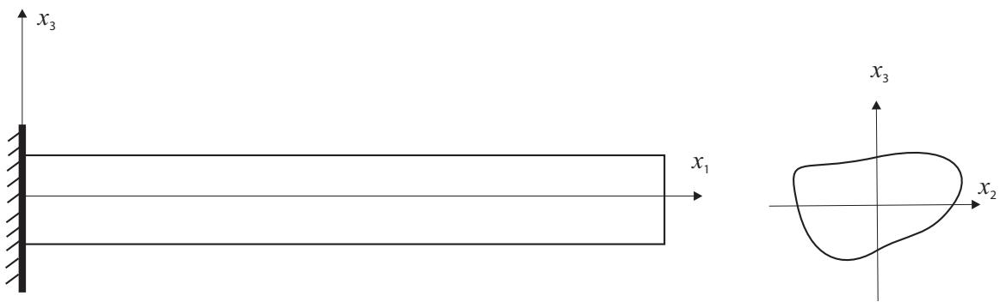
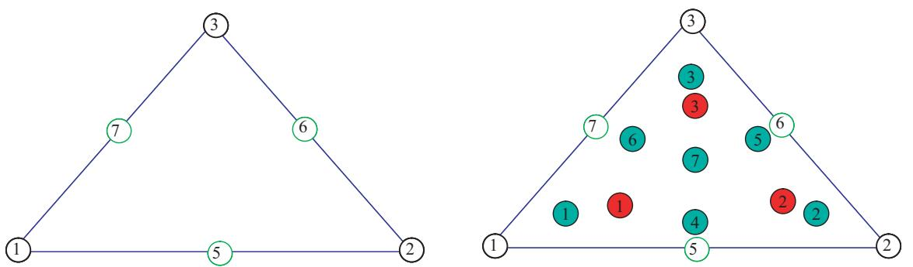
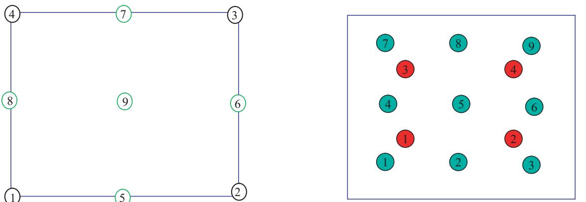
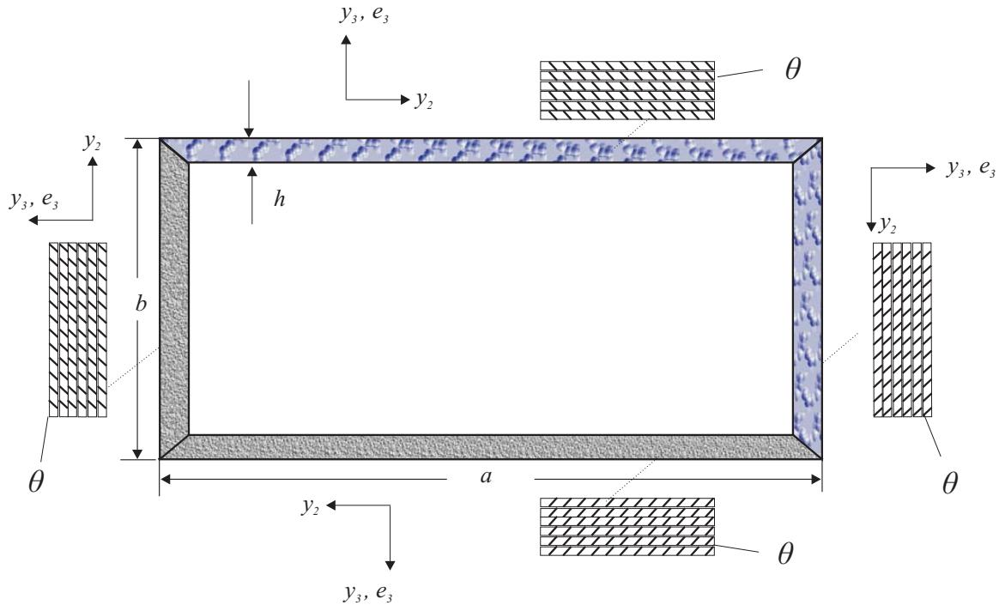

# Conventions

To understand the inputs and interpret outputs of the program correctly, we need to explain some conventions used by VABS.

:::{figure-md} fig-beam_coord_sys

VABS beam coordinate system
:::

First, VABS uses a right hand system, the beam coordinate system, denoted as $x_1$, $x_2$ and $x_3$, where $x_1$ is along the beam axis and $x_2$ and $x_3$ are the local Cartesian coordinates of the cross section, see {numref}`fig-beam_coord_sys` for a beam with an arbitrary cross section.
Usually, for rotor blades, $x_1$ is along the direction of the span and points to the tip, $x_2$ is along the direction of the leading-edge to the trailing edge and points to the direction of the leading edge, and $x_3$ can be determined by the right hand rule.
Usually the origin of $x_1$ is located at the root of the blade, yet the user is free to choose the origin of $x_2$ and $x_3$ at an arbitrary point of the cross section, such as the mass center, centroid, or shear center.
Detailed information is needed to define the cross-sectional geometric domain spanned by $x_2$ and $x_3$ and the materials that occupy that domain.
Also, certain characteristics along the span direction, such as initial curvature/twist or taper, are needed for cross-sectional analyses when they are not equal to zero.
The obliqueness should be specified when the angle between $x_1$ and the $x_2$-$x_3$ plane is not equal to $90^{\circ}$, that is, when reference cross section is not normal to the reference line, such as the case of a swept wing.
It is noted that the beam coordinate system is the same as the undeformed beam coordinate system b defined in Ref. [\[10\]].

Second, VABS numbers the nodes of each element in the counterclockwise direction, as shown in {numref}`fig-tri_elem` for triangular elements and {numref}`fig-quad_elem` for quadrilateral elements.
Nodes 1, 2, and 3 of the triangular elements and nodes 1, 2, 3, and 4 of the quadrilateral elements are at the corners.
Nodes 5, 6, 7 of the triangular elements and nodes 5, 6, 7, 8, 9 for quadrilateral elements are optional nodes.

:::{figure-md} fig-tri_elem

VABS triangular element node numbering and corresponding integration schemes
:::

:::{figure-md} fig-quad_elem

VABS quadrilateral element node numbering and corresponding integration schemes
:::

The recovered 3D displacements are values at each node expressed in the VABS beam coordinate system ({numref}`fig-beam_coord_sys`).
However, stresses and strains are most accurately evaluated at Gaussian integration points.
Gaussian integration schemes for different orders of the two types of elements are also shown in {numref}`fig-tri_elem` and {numref}`fig-quad_elem`.
The red interior points correspond to the integration scheme for linear elements and the green interior points correspond to the integration scheme for quadratic elements.
VABS can also recover 3D stresses and strains at each node as suggested by our industry users.
The recovered stresses, and strains are expressed in both the beam coordinate system and the material coordinate system, which is essential for applying failure criteria.

VABS allows users to use various kinds of units.
However, it is necessary to be absolutely consistent in the choice of units to avoid errors.
Particularly, users must never use the pound as a unit of mass to avoid confusion.
When pounds are used for force and feet for length, the unit of mass must be the slug = lb-sec2/ft; if inches are used for length along with pounds for force, then the unit of mass must be lb-sec2/in.

:::{figure-md} fig-local_coord_sys

VABS layup convention
:::

Finally, to understand the VABS input convention for composite layups, we need to find relationships among three coordinate systems: the beam coordinate system ($x_1$, $x_2$, $x_3$) used by the user to define the geometry, the material system ($e_1$, $e_2$, $e_3$) used by the user to define the material properties, and an intermediate one to define the ply plane ($y_1$, $y_2$, $y_3$).
As shown in {numref}`fig-local_coord_sys`, the ply coordinate system ($y_1$, $y_2$, $y_3$) is formed by rotating the global coordinate system ($x_1$, $x_2$, $x_3$) in the right-hand sense about $x_1$ by the amount $0 \le \theta_1 \le 360^{\circ}$.
Then, the ply coordinate system ($y_1$, $y_2$, $y_3$) is rotated about $y_3$ in the right-hand sense by the amount $−90^{\circ} \le \theta_3 \le 90^{\circ}$ to form the material system ($e_1$, $e_2$, $e_3$), the range of $\theta_3$ being same as is commonly defined in the field of the composite materials.
Here we use the box-beam section depicted in {numref}`fig-local_coord_sys_box` to illustrate VABS layup conventions.
Here, $x_1$ is pointing toward the reader, $x_2$ is pointing to the right side of the reader, and $x_3$ is pointing upward vertically.
For the upper wall: $\theta_1 = 0^{\circ}$; the left wall: $\theta_1 = 90^{\circ}$; the lower wall: $\theta_1 = 180^{\circ}$; the right wall: $\theta_1 = 270^{\circ}$. For all the walls $\theta_3 = \theta$ for the box-beam in {numref}`fig-local_coord_sys_box` because all the fibers are rotating positively about $y_3$/$e_3$ by the angle $\theta$.
The users can specify their own stacking sequences.
The stacking sequences expressed from the innermost layer to the outermost layer for each wall are often used.

:::{figure-md} fig-local_coord_sys_box

VABS layup convention for a box-beam
:::
